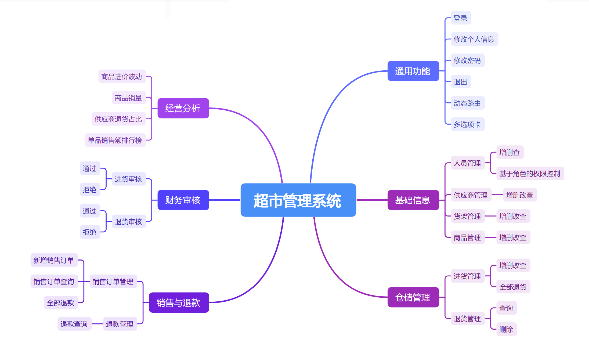

<h3 style="color:red;text-align:center">乐之者java: https://www.roadjava.com 制作</h3>

<h1 style="color:orange;text-align:center">超市管理系统</h1>

### 一、项目介绍与演示



### 二、使用到的技术

后端技术体系：maven + springboot 2.6.13 + mybatis plus + mybatis  + mysql 8

前端技术体系-vue3全家桶：vite + vue3+ typescript + vue-router + pinia + axios + element-plus + echarts

### 三、配置运行步骤

==注意:不要把代码放在含有空格或中文的目录==

####3.1 后台

#####3.1 idea导入运行步骤

1. 导入
2. 配置

   * project-->jdk的配置

   * module下面 :  jdk的选择
3. 执行“要用到的sql.sql"
4. 修改application.yml

   * 数据库端口、用户名和密码
   * 文件上传路径
5. 后台管理端启动后访问   http://localhost:8000/  验证是否成功

#####3.2  eclipse导入运行步骤

1. 导入: file--->open project from file system
2. 配置
   * Resource-->编码utf-8
   * java build path-->jdk的选择
3. 其余与“**3.1、idea导入运行步骤**”中完全一样

####3.2 前端配置运行步骤

1. 前端环境

   npm教程: https://www.bilibili.com/video/BV1CQ4y167oc

   ```shell
   node -v
   npm -v 
   ```

2. 在源码目录(package.json所在目录)执行

   ```shell
   npm install
   ```

3. 启动前端程序

   ```shell
   npm run dev
   ```

   ==注意==：后端地址的配置位置

4. 管理页面启动成功后访问：  http://localhost:8001

   管理员默认账号和密码:   admin/123456
